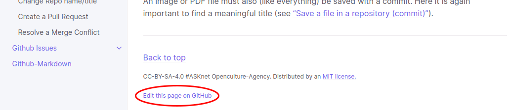
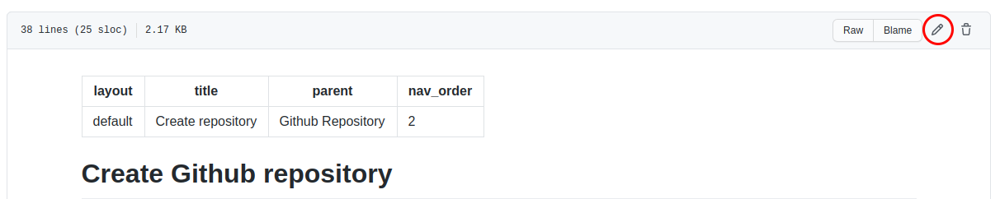
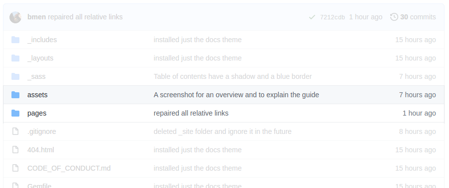

# #ASKnet Github-Guidance

This repository includes a guide to help with using Github.This guide was created at one of the worldwide #ASKnet programs, which is about helping people to help themselves.  With Github or Git in the background, actions/projects or ideas can be documented wonderfully and archived in historical versions.This guide is from the beginning as a git repository about a git repository :)

## --===<({   [Here it goes to the guide](https://asknet-open-training.github.io/Github-Guidance)   })>===--

There you find all information about how to use Github and get support

Some important informations:
1. Working with you GitHub account issues.
2. Creating repository and forking existing repository.
3. Using issues for communicating tasks.
4. Handling merges and merges conflicts.
5. Mastering other collaboration features of the platform

## Feedback

If you want to give us feedback, feel free to write us: [Give a Feedback](https://github.com/ASKnet-Open-Training/Github-Guidance/issues/new)

## Developers

The guide consists of Markdown files that are rendered as HTML pages using jekyll and Github Actions.

If you have a suggestion or even concrete content incl. screenshots, feel free to [write us an issue](https://github.com/ASKnet-Open-Training/Github-Guidance/issues/new).

If you already know the basics of Git and Markdown, feel free to write content yourself. Here you can learn how to edit content. There are two methods to get to the right place you want to edit.

### Method 1 Get to the content via the HTML page (easier)

You can switch from this repository to the HTML page: https://asknet-open-training.github.io/Github-Guidance/

Then browse to your desired page and you'll find an `Edit this page on GitHub` link at the bottom of each page. Clicking on it will take you to the exact Markdown file you want to edit.

Once you have reached the Markdown file, you can use the pen button to go into edit mode and change the content. Afterwards, the change is saved as a commit or a change suggestion is made in the form of a pull request. How a [commit](https://asknet-open-training.github.io/Github-Guidance/pages/github-repo/file-save/) works or a [pull request](https://asknet-open-training.github.io/Github-Guidance/pages/github-repo/pull-request-create/) is made, you can find out [in this guide](https://asknet-open-training.github.io/Github-Guidance/) ;)

### Method 2 Use the Git Repository (advanced)

You can go through the Git repository and mainly all the content for the guide can be found in two directories:

- assets -> images
- pages

You can ignore the other directories.

#### Pages

In the `pages` directory you will find all pages sorted into the subfolders corresponding to the main points of the guide (e.g. github-account or github-repo).

#### Images

All images are uploaded to the `images` directory. This directory is located in the top directory `assets`. 

The name of an image should be descriptive and not e.g. ~~IMG_345345345.jpg~~. It is recommended to use the name of the main topic at the beginning and after a - the name of the current topic.

Example: `github-repo` `-` `create-new-repo` `.png`

**Important:** Do not upload images that are too large, otherwise the entire repository would become too big.

Alternatively, you are welcome to [write us an issue](https://github.com/ASKnet-Open-Training/Github-Guidance/issues/new) and upload your desired image there. You just have to tell us on which page the image should be displayed ;) 

## Partners and Founders

| r0g Agency | ASKnet | Open Source Ecology Germany |
| :--------: | :----: | :-------------------------: |
|||  |
| [Official Website](https://openculture.agency/) | [Official Website](https://github.com/ASKnet-Open-Training) | [Official Website](https://opensourceecology.de/) |

## License

 This work is licensed under a <a rel="license" href="http://creativecommons.org/licenses/by-sa/4.0/">Creative Commons Attribution-ShareAlike 4.0 International License</a>.