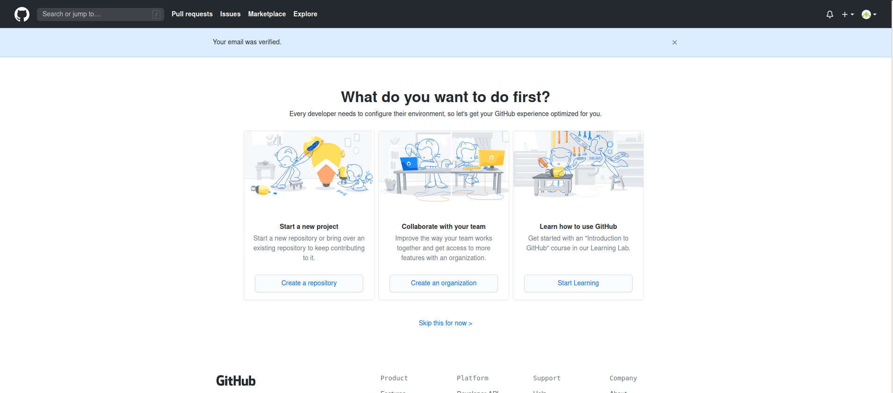

## Create a GitHub Account
Creating a Github account is very easy and free. All you need is:

- unique username (availibility check)
- mail address
- password

You will receive an email, which must be confirmed, otherwise your profile will not be displayed publicly and you will not be able to be added to any projects.

## Go to your profile to share with others

A profile page is automatically created for your Github account, where you and others can see your activities on Github.

The URL is always `https://github.com/Accountname`

You can reach your own profile by clicking on your profile picture in the upper right corner and then on `Your Profile`

There you also have the possibility to upload a profile picture. That makes the world more colorful ;)

## Find other profiles or organisations

If you don't know the URL to the other profile, organization, or repository, but you know the name, you can search for it using Github's search box. Just make sure you select `All Github`. Otherwise Github will only search the repository you are currently in.

