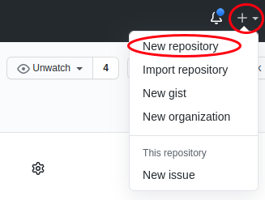
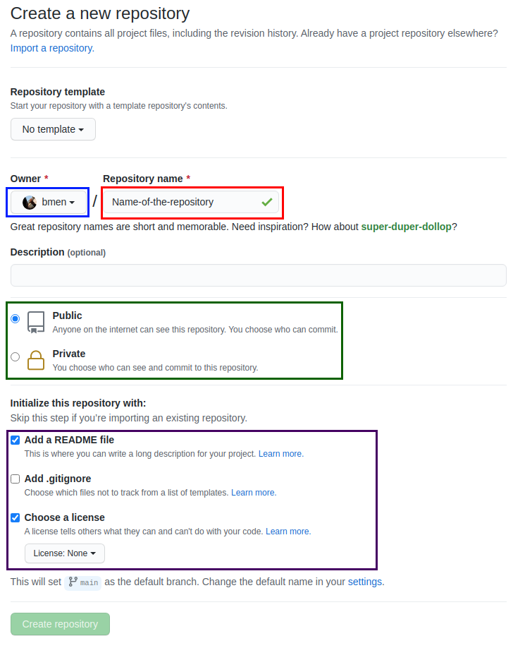
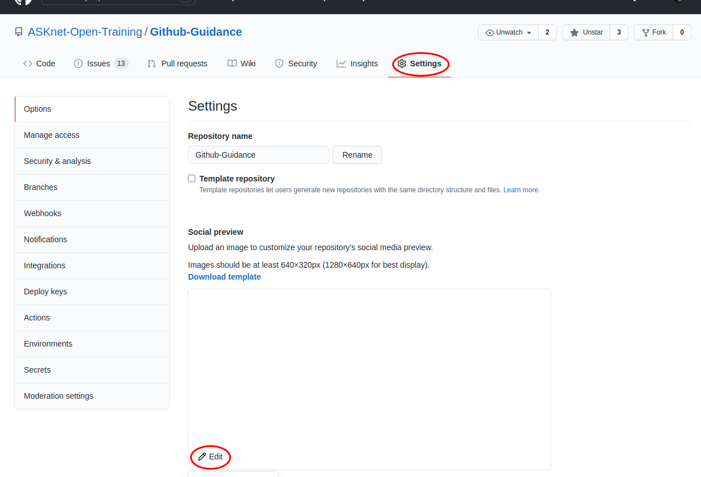

## Create Github repository
You can see in the upper right corner a + symbol. There you can create your own repository.

### Name and owner of the repository

On the next page you should give your new repository a name and specify who should own the repository. Either your own account or an organization.

### Public or Private?

You can make your repository public, then anyone can see it, but not edit it. Unless the repository has been assigned to an organization, then according to the rights of the members in the organisation can edit the repository. You can also manually add more accounts to your own repository.

If you set the repository to private, then no one can see or edit the repository. Only if you manually add more accounts.

### README and License

Please always create a README and a license file for your repository! In the README you can briefly describe what your repository is about. The license file ensures that your repository is open source. Unfortunately not all license types are available as templates. So choose the MIT license at the beginning. Click on the arrow next to `License: None` and type `MIT` in the search field and select the license. You can replace it later with another license.

**Congratulation your repository is now created!**

----

## Add/change a Social Preview image to the repository

In your repository, you should start by uploading an image and entering a small description. So that people can recognize your repository better.

## Upload images to Repo
## Upload a picture to a repository
## Insert the gif of the guide to create a github repository and write a short documentation
## Create supfolder/directory for images etc. with placeholderfile
## Fix/add a missing Open Source License file from template
## How to fork a Repository
## Navigate to own fork and change Repo name/title
## Resolve a Merge Conflict for a Pull Request
## Create a Pull Request