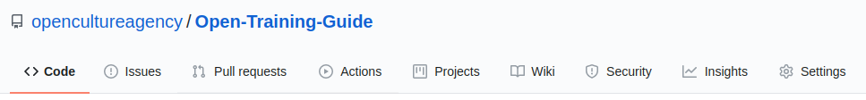
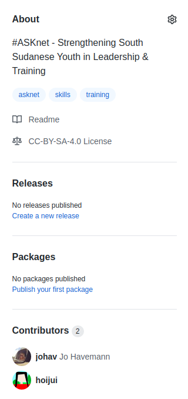
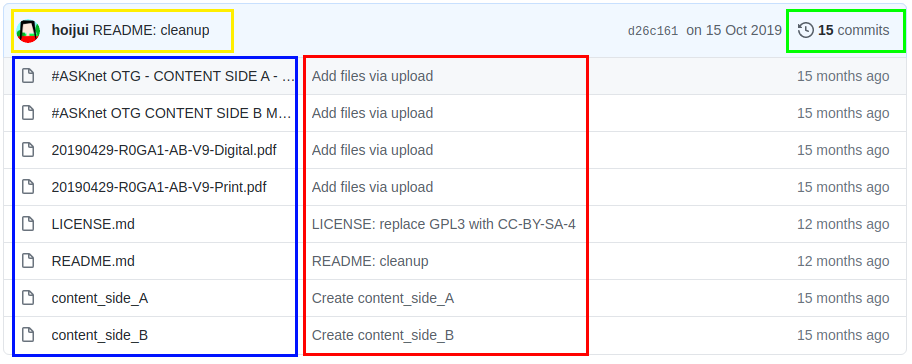
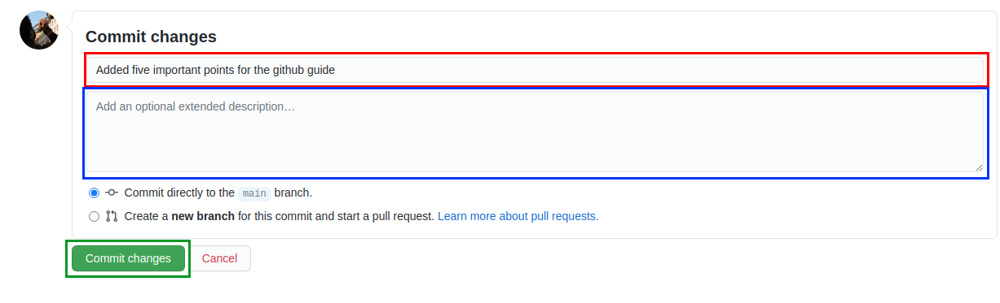

# Github Repository

## Explaining a repository
### Navigation in short words

How to navigate inside a repository

| Navigation    | Description |
| ------------- | ----------- |
| Breadcrump    | Organisation/Repository Menu |
| Code          | See/upload/edit all content/files/folders insight a repository |
| Issues        | See/create issues |
| Pull requests | When someone wants to send a change to the repository, they do so via a pull request. The changes can be accepted or rejected. |
| ~~Actions~~   |  |
| Wiki          | If a readme file is not sufficient for the description or help for the repository, then a wiki with different pages can be created. |
| ~~Projects~~  |  |
| ~~Security~~  |  |
| ~~Insights~~  |  |
| Settings      | All settings for the repository can be made here. (e.g. Name of the repository, Description, [Social Preview image](#addchange-a-social-preview-picture-to-a-repository) or Access) |

### Short introduction about the sidebar

| Points to explain | Screenshot |
| ----------------- | ---------- |
| **About:** It's important to write a short description about the project and you can put links and tags in it. **Readme:** Link to the Readme file **License:** Link to license file **Releases:** If your content of your repository has different versions. It called releases (e.g. v.0.1 or v.1.0) **~~Packages~~** **Contributers:** All accounts that have write access to the repository |  |

### File explorer

The user how commit the last changes and a short commit message

Here you can see the number of changes/commits and view the history

Here goes the commit message

All files and folders in this repository (you cannot make folders over the webinterface!)

----

## Create Github repository
You can see in the upper right corner a + symbol. There you can create your own repository.

### Name and owner of the repository

On the next page you should give your new repository a name and specify who should own the repository. Either your own account or an organization.

### Public or Private?

You can make your repository public, then anyone can see it, but not edit it. Unless the repository has been assigned to an organization, then according to the rights of the members in the organisation can edit the repository. You can also manually add more accounts to your own repository.

If you set the repository to private, then no one can see or edit the repository. Only if you manually add more accounts.

### README and License

Please always create a README and a license file for your repository! In the README you can briefly describe what your repository is about. The license file ensures that your repository is open source. Unfortunately not all license types are available as templates. So choose the MIT license at the beginning. Click on the arrow next to `License: None` and type `MIT` in the search field and select the license. You can replace it later with another license.

**Congratulation your repository is now created!**

----

## Add/change a Social Preview image to the repository

In your repository, you should start by uploading an image and entering a small description. So that people can recognize your repository better.

----

## Edit the Readme

The readme is automaticly parsed as html page and it's under the file explorer. There you can give the important information about the repository. 
* Explanation
* How to use it

Here you can edit the readme

**Tip:** To edit a markdown you can [have a look to the syntax](github-markdown)

----

## Save a file in a repository (commit)

To edit a Markdown file like a readme you should have a look at the syntax of [Markdown](github-markdown). Because you can create headings, list items, links and more to make your text clearer. Markdown is a very simple format and is used in more and more areas like wikis or issuesystems.

In Git systems it is necessary to leave a small message (commit message) of what or why you made a change (commit). You can leave a title (required) and a description for a commit. The description is only needed if the title is not sufficient. But a meaningful title would be great!

----
## Upload images to Repo
## Upload a picture to a repository
## Insert the gif of the guide to create a github repository and write a short documentation
## Create supfolder/directory for images etc. with placeholderfile
## Fix/add a missing Open Source License file from template
## How to fork a Repository
## Navigate to own fork and change Repo name/title
## Resolve a Merge Conflict for a Pull Request
## Create a Pull Request